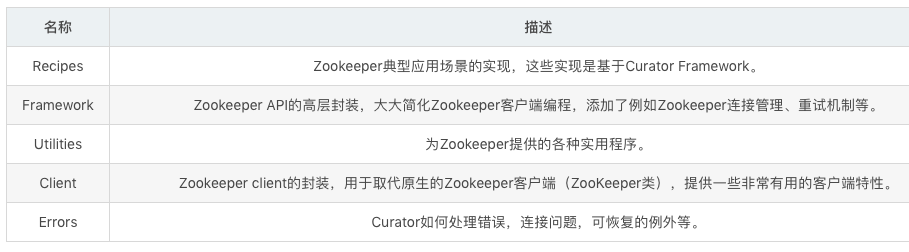
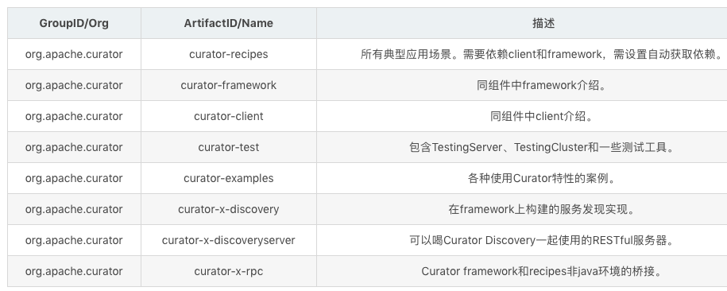

curator是什么?
``` 
    Curator是Netflix公司开源的一套Zookeeper客户端框架。了解过Zookeeper原生API都会清楚其复杂度。Curator帮助我们在其基础上进行封装、实现一些开发细节，
包括接连重连、反复注册Watcher和NodeExistsException等。目前已经作为Apache的顶级项目出现，是最流行的Zookeeper客户端之一。从编码风格上来讲，
它提供了基于Fluent的编程风格支持。
    除此之外，Curator还提供了Zookeeper的各种应用场景：Recipe、共享锁服务、Master选举机制和分布式计数器等。 
```

版本选型
``` 
目前Curator有2.x.x和3.x.x两个系列的版本，支持不同版本的Zookeeper。其中Curator 2.x.x兼容Zookeeper的3.4.x和3.5.x。
而Curator 3.x.x只兼容Zookeeper 3.5.x，并且提供了一些诸如动态重新配置、watch删除等新特性。
```





``` 
绝大部分场景，提供一下依赖就可以解决问题
<dependency>
    <groupId>org.apache.curator</groupId>
    <artifactId>curator-recipes</artifactId>
    <version>4.0.0</version>
</dependency>
```

创建客户端并启动会话
``` 
注：sessionTimeoutMs 默认图 60s，connectionTimeoutMs默认 15s。

BoundedExponentialBackoffRetry：重试指定次数，失败后加大时间间隔
ExponentialBackoffRetry：重试一定次数，每次重试时间依次递增
RetryForever：一直重试
RetryNTimes：重试N次
RetryOneTime：重试一次
RetryUntilElapsed：重试一定时间

1.创建 重试策略 连接失败后，连续重试 3 次直至成功，每次休眠 1s
RetryPolicy retryPolicy = new ExponentialBackoffRetry(1000,3);

源码(在elapsedTimeMs基础上逐步增加时间间隔，重试指定次数，直至成功)
protected long getSleepTimeMs(int retryCount, long elapsedTimeMs) {
    long sleepMs = (long)(this.baseSleepTimeMs * Math.max(1, this.random.nextInt(1 << retryCount + 1)));
    if (sleepMs > (long)this.maxSleepMs) {
        log.warn(String.format("Sleep extension too large (%d). Pinning to %d", sleepMs, this.maxSleepMs));
        sleepMs = (long)this.maxSleepMs;
    }
    return sleepMs;
}

2.创建客户端
public static CuratorFramework newClient(String connectString, RetryPolicy retryPolicy)
public static CuratorFramework newClient(String connectString, int sessionTimeoutMs, int connectionTimeoutMs, RetryPolicy retryPolicy)

源码（两种不同的newClient方式底层封装的都是 builder）
public static CuratorFramework newClient(String connectString, int sessionTimeoutMs, int connectionTimeoutMs, RetryPolicy retryPolicy) {
    return builder().connectString(connectString).sessionTimeoutMs(sessionTimeoutMs).connectionTimeoutMs(connectionTimeoutMs).retryPolicy(retryPolicy).build();
}

3.启动会话
client.start()

```

创建节点
``` 
默认创建内容为空的持久节点
1.创建空节点(持久节点)
client.create().forPath(path);

2.创建内容部位空的持久节点
client.create().forPath(path,"我是内容".getBytes());

3.递归创建临时节点
client.create().creatingParentsIfNeeded().withMode(CreateMode.EPHEMERAL).forPath("/aa/bb");

源码:
PERSISTENT：持久节点
PERSISTENT_SEQUENTIAL：持久序列化节点
EPHEMERAL：临时节点
EPHEMERAL_SEQUENTIAL：临时序列化节点
CONTAINER：容器类型
PERSISTENT_WITH_TTL：带生命周期持久节点
PERSISTENT_SEQUENTIAL_WITH_TTL：带生命周期持久化序列节点
```

删除节点
``` 
1.删除单节点
client.delete().forPath(path);

2.级联删除
client.delete().deletingChildrenIfNeeded().forPath(path);

3.删除指定版本节点(默认最新版本为-1)
client.delete().withVersion(1).forPath(path);
注：版本不存在，抛异常org.apache.zookeeper.KeeperException$BadVersionException: KeeperErrorCode = BadVersion for

4.强制保证删除(客户端持续执行删除操作，直至成功，避免网络故障，导致假删除)
client.delete().guaranteed().forPath(path);
```

读取数据
``` 
1.普通查询
client.getData().forPath(path);

2.包含状态查询
Stat stat = new Stat();
client.getData().storingStatIn(stat).forPath(path);
```

更新数据
``` 
1.普通更新（默认更新最新版本）
client.setData().forPath(path,"新内容".getBytes());

2.指定版本更新
client.setData().withVersion(1).forPath(path);
注：乐观锁操作：先获取版本，然后执行修改，如果版本已经更新，则当前提交修改失败，抛异常 org.apache.zookeeper.KeeperException$BadVersionException: KeeperErrorCode = BadVersion for。
```

异步接口
``` 
异步更新数据，然后洗护发回调
//  后台操作触发监听，并且在启动 停机时都不触发监听回调函数
BackgroundCallback callback = new BackgroundCallback() {

    @Override
    public void processResult(CuratorFramework client, CuratorEvent event)
            throws Exception {
        System.out.println(event.getPath());
    }
};

//异步设置某个节点数据
client.setData().inBackground(callback).forPath("/curator","/curator modified data with Callback".getBytes());

System.out.println ("sleep for 10000 ms" ); // 先打印 sleep 再打印 path
//为了防止单元测试结束从而看不到异步执行结果，因此暂停10秒
Thread.sleep(10000);

注：所有 getData() setData delete create 接口都提供了异步接口。
```

事务
``` 
 //定义几个基本操作
CuratorOp createOp = client.transactionOp().create()
        .forPath("/curator/one_path","some data".getBytes());

CuratorOp setDataOp = client.transactionOp().setData()
        .forPath("/curator/one_path","other data".getBytes());

CuratorOp deleteOp = client.transactionOp().delete()
        .forPath("/curator/one_path");

//事务执行结果
List<CuratorTransactionResult> results = client.transaction()
        .forOperations(createOp,setDataOp,deleteOp);

//遍历输出结果
for(CuratorTransactionResult result : results){
    System.out.println("执行结果是： " + result.getForPath() + "--" + result.getType());
}
/* 事务操作： 创建 修改 删除 打包成原子操作
    执行结果是： /curator/one_path--CREATE
    执行结果是： /curator/one_path--SET_DATA
    执行结果是： /curator/one_path--DELETE
 */
```

命名空间
``` 
1.创建客户端
client = CuratorFrameworkFactory.builder()
                    .namespace("mydemo/v1")
                    .connectString(CONNECT_STRING)
                    .sessionTimeoutMs(SESSION_TIMEOUT)
                    .connectionTimeoutMs( CONNECTION_TIMROUT )
                    .retryPolicy(retryPolicy)
                    .build();
2.开启会话
client.start ();
 
3.在命名空间下面创建了子目录
client.create().creatingParentContainersIfNeeded()
        .forPath("/server1/method1","some data".getBytes());

//创建带命名空间的连接实例 withNameSpace = true
// [zk: localhost:2181(CONNECTED) 4] ls /mydemo/v1/server1
//[method1]

```

[Curator代码演示](https://github.com/GitHuHao/curator/tree/master/src/main/java/com/apache/zookeeper/curator)

